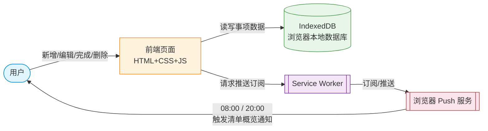

# TECH_DESIGN.md｜今日待办

> Day 5 产出（2026-09-20）。本文档把 Day 4 `PRD.md` 里「故意留空」的技术方案落定：选定技术路线、说清每个模块用什么实现、画出数据流图。  
> 范围约束：本文档只回答「用什么做」和「数据怎么流转」，不开始写代码（编码属于后续天数）；不改 `PRD.md` 任何条目。

---

## 一、文档信息

| 项目        | 内容                                   |
| --------- | ------------------------------------ |
| 项目名       | 今日待办                                 |
| 文档版本      | v1.0                                 |
| 作者        | Charlie-xylz                         |
| 创建日期      | 2026-09-20                           |
| 依据文档      | `PRD.md` v1.2（Day 4）                 |
| 本文档要回答的问题 | ① 数据从哪来、到哪去 ② 选哪条技术路线、为什么 ③ 各模块用什么实现 |

---

## 二、技术路线

### 2.1 硬约束（PRD 9.2 重申）

> 手机浏览器在页面关闭后无法主动推送提醒，而手机是本期的唯一使用设备，F2 是核心价值的唯一载体。

**含义**：任何「页面关了就没法提醒」的技术路线，F2 都会失效，整条路线直接出局。这是 Day 5 选型的**第一道筛子**，不是加分项。

### 2.2 候选路线比较

| 路线                        | 是什么                            | F2 提醒            | 数据存哪          | 结论            |
| ------------------------- | ------------------------------ | ---------------- | ------------- | ------------- |
| A. 纯静态网页                  | HTML + JS + localStorage       | ❌ 页面关闭后无法定时醒     | 浏览器本地         | 出局：F2 死       |
| B. 纯网页 + Notification API | 在 A 上加浏览器通知                    | ⚠️ 只能页面开着时弹，关了失效 | 浏览器本地         | 出局：F2 名存实亡    |
| **C. PWA**                | 网页 + Service Worker + Push API | ✅ 系统级推送，页面关着也能弹  | 浏览器 IndexedDB | **入选**        |
| D. 原生 App（RN / Flutter）   | 写真正的 iOS/Android 应用            | ✅ 系统通知最稳         | 手机 SQLite     | 出局：开发成本远超本期需要 |

### 2.3 选定路线：PWA（Progressive Web App）

**一句话**：仍是一个网页，但通过 Service Worker 让它能被「安装」到手机主屏，并借系统推送通道在页面关闭时也能触发提醒。

**为什么是 C**：

1. **F2 能落地**——这是 PRD 9.2 的硬约束，A、B 都做不到，C 是开发成本最低的可行解。
2. **与现有技能栈无缝衔接**——Day 1–2 已经写过 HTML/JS，PWA 不是重新学一门语言，而是在已会的东西上加一层「壳」。
3. **天然符合 PRD 的两端口径**——PWA 在电脑浏览器里也能打开用（AC-21 直接满足）；数据存在浏览器本地，两端各存各的，正好等于「本期不做同步」的决定（PRD 6.2）。
4. **零后端、零服务器费用**——GitHub Pages 免费托管且自带 HTTPS，符合「本期不做账号体系、不上第三方登录」（PRD 6.1）。

**已知代价与风险（写在这里，是给未来的自己拦路）**：

| 风险                                                         | 影响            | 本期应对                                   |
| ---------------------------------------------------------- | ------------- | -------------------------------------- |
| iOS（iPhone）上 PWA 推送需要先「添加到主屏」                              | 不添加就收不到 F2 提醒 | 首次打开时给显式引导；并在 README / 使用说明里写清         |
| Android 上不同厂商对 PWA 推送支持不一致                                 | 部分机型可能收不到提醒   | 验收以主力机为准；失败机型按 PRD 9.2 兜底方案降级为「打开时提示」  |
| Push API 需要一个推送服务（如 Firebase Cloud Messaging 或 Web Push 库） | 配置稍复杂，需要订阅管理  | 优先使用开源的 Web Push 方案，避免绑定特定厂商           |
| 数据存在浏览器 IndexedDB，清浏览器缓存会清掉数据                              | 用户主动清缓存时可能丢数据 | 本期接受（PRD 6.2 明确不做同步）；如实际使用反馈强烈，再考虑备份方案 |

### 2.4 技术栈明细

| 层    | 选型                           | 用途                            | 不选其它方案的理由                                         |
| ---- | ---------------------------- | ----------------------------- | ------------------------------------------------- |
| 页面结构 | 纯 HTML + CSS + 原生 JavaScript | 渲染首页清单、新增/编辑/完成/删除四个操作        | 不引入 React / Vue：页面只有一屏，引入框架等于杀鸡用牛刀，还增加学习成本        |
| 数据存储 | IndexedDB                    | 存事项数据（标题、日期、是否完成、周期类型）        | localStorage 容量小、不支持结构化查询；IndexedDB 是浏览器内置的「真数据库」 |
| 离线访问 | Service Worker               | 让网页断网也能打开                     | PWA 的标配，不引入额外技术                                   |
| 定时提醒 | Push API + Notification API  | F2 的提醒通道：08:00 / 20:00 触发清单概览 | 不用 setTimeout：页面关了就不执行；Push API 走系统通道，页面关着也能弹     |
| 托管   | GitHub Pages                 | 免费、自带 HTTPS、和代码同仓             | 不自己买服务器：本期不上后端，HTTPS 也是 PWA 和 Push API 的硬性要求      |

### 2.5 模块 ↔ 选型对照表

| PRD 功能                  | 实现模块            | 技术                                           |
| ----------------------- | --------------- | -------------------------------------------- |
| F1 打开即看清要做的事            | 首页渲染            | HTML + CSS + 原生 JS                           |
| F2 每天固定 1–2 次清单提醒       | 定时触发 + 系统通知     | Service Worker + Push API + Notification API |
| F3 事项的新增 / 编辑 / 完成 / 删除 | 数据增删改查          | 原生 JS + IndexedDB                            |
| F4 周期事项（每天/每周/每月）       | 周期逻辑 + 自动生成下次日期 | 原生 JS（在 IndexedDB 上封装周期规则）                   |
| 跨功能约束（手机 + 电脑都能用）       | 响应式布局           | CSS Media Query（原生）                          |
| 跨功能约束（两端不要求数据一致）        | 数据存本地浏览器        | IndexedDB（不做云端同步）                            |

---

## 三、数据流图

### 3.1 图例

- **方框** = 角色 / 系统 / 存储（数据在这里被处理或存放）
- **箭头** = 数据流向（箭头上的字 = 这一步传的是什么数据）
- **虚线框** = 数据「经过但不被修改」的地方

### 3.2 主数据流图

**读图顺序**：从左到右跟两条主线——

1. **增删改主线（绿线）**：你在页面上点「新增一条事项」→ 前端把这条数据写进 IndexedDB → 下次打开首页时，前端从 IndexedDB 读出来渲染。
2. **提醒主线（粉线）**：首次打开时前端通过 Service Worker 向浏览器申请推送订阅 → 到了 08:00 / 20:00，浏览器 Push 服务唤醒 Service Worker → 弹出系统通知 → 你看到「今日清单概览」。

### 3.3 两条关键数据流的逐步拆解

#### 流 A：新增一条事项「洗衣服」

| 步骤                           | 发生在哪     | 数据形态                                     |
| ---------------------------- | -------- | ---------------------------------------- |
| 1. 用户输入「洗衣服」，点保存             | 前端页面     | 字符串「洗衣服」                                 |
| 2. 前端给数据补上默认日期（录入日+1）和未完成状态  | 前端页面     | `{title, date, done:false, repeat:null}` |
| 3. 前端把这个对象写进 IndexedDB       | 浏览器本地数据库 | 一条新记录                                    |
| 4. 首页重新从 IndexedDB 读出所有未完成事项 | 前端页面     | 渲染成列表                                    |
| 5. 用户在屏幕上看到「洗衣服」排在未完成区       | 手机屏幕     | 可见条目                                     |

#### 流 B：每天 20:00 触发「今日清单概览」

| 步骤                                               | 发生在哪                       | 数据形态        |
| ------------------------------------------------ | -------------------------- | ----------- |
| 1. 首次打开时，前端请求推送权限，用户允许                           | 浏览器                        | 授权标志        |
| 2. 前端通过 Service Worker 拿到订阅凭证（Push Subscription） | Service Worker             | 一个 URL + 密钥 |
| 3. 把这个凭证存到本地（IndexedDB 或 Cache Storage）          | 浏览器本地                      | 订阅对象        |
| 4. 浏览器 Push 服务按本机时钟，在 20:00 触发推送                 | 系统级 Push 服务                | 唤醒信号        |
| 5. Service Worker 被唤醒，从 IndexedDB 读出「今日未完成事项列表」  | Service Worker + IndexedDB | 数组          |
| 6. Service Worker 组装通知文案（清单概览，不含指令）              | Service Worker             | 字符串         |
| 7. 通过 Notification API 弹出系统通知                    | 手机通知栏                      | 用户可见通知      |

### 3.4 数据存取位置一览

| 数据                       | 存在哪                       | 谁来读写                   |
| ------------------------ | ------------------------- | ---------------------- |
| 事项数据（标题、日期、状态、周期）        | IndexedDB                 | 前端读写；Service Worker 只读 |
| 推送订阅凭证                   | IndexedDB 或 Cache Storage | 前端写；Service Worker 读   |
| 提醒时刻设置（默认 08:00 / 20:00） | IndexedDB                 | 前端读写；Service Worker 读  |
| 当前页面渲染状态                 | 内存（关掉就消失）                 | 前端自己                   |

---

## 四、方案变化时的影响范围（余力加练，待用户确认后再补）
