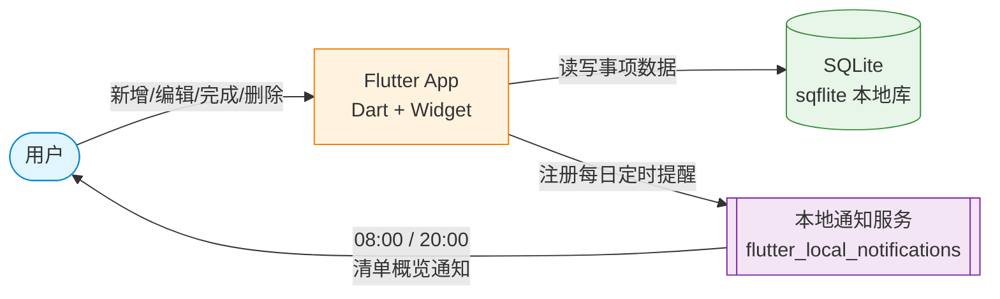

# TECH_DESIGN.md｜今日待办

> Day 5 产出（2026-09-20）。本文档把 Day 4 `PRD.md` 里「故意留空」的技术方案落定：选定技术路线、说清每个模块用什么实现、画出数据流图。  
> 范围约束：本文档只回答「用什么做」和「数据怎么流转」，不开始写代码（编码属于后续天数）；不改 `PRD.md` 任何条目。  
> v1.1 修订（2026-09-24，Day 9）：技术路线由 Web/PWA 改为 Flutter 安卓 App（用户拍板）。2.1 的硬约束因路线变更而解除，2.2 结论翻转（D 入选、C 出局），2.3–2.5 与第三章按新路线重写。

---

## 一、文档信息

| 项目 | 内容 |
| --- | --- |
| 项目名 | 今日待办 |
| 文档版本 | v1.2 |
| 作者 | Charlie-xylz |
| 创建日期 | 2026-09-20 |
| 依据文档 | `PRD.md` v1.4（Day 4 制定 / Day 9 路线对齐 / Day 9 校准） |
| 本文档要回答的问题 | ① 数据从哪来、到哪去 ② 选哪条技术路线、为什么 ③ 各模块用什么实现 |
| 修订记录 | v1.0 首版（选定 PWA 路线）；v1.1 路线变更：改用 Flutter 做安卓 App，路线结论与全部技术选型重写；v1.2 文档校准（2026-09-24）：2.3 风险表「本机未建模拟器」更正为已建 AVD `today_todo_api36` 并以其为调试环境；4.1「旧 Web 代码退役」更正为「保留作参照，待 F1+F3 跑通后删除」 |

---

## 二、技术路线

### 2.1 硬约束（原条已解除，现行约束见下）

> **v1.1 变更**：原硬约束是「手机浏览器在页面关闭后无法主动推送提醒」，这是 Day 5 选型的第一道筛子。

**现状**：改用原生 App 后，**这条约束不复存在**。系统通知是原生 App 的标准能力，与「页面开着还是关着」无关。原先卡住整条技术路线的问题，被路线本身解掉了。

**现行的两条硬约束**（来自用户 2026-09-23 拍板）：

1. **只做安卓**（不做 iOS）——省掉 Mac + Xcode + 付费开发者账号这一整条成本。
2. **项目路径不能含空格或中文**——Flutter 底层的 Gradle / CMake 对这类路径支持很差，会报「看不出原因」的编译错误。
   → 新工程放 `D:\dev\today_todo`；本仓库继续留作文档与旧版存放处。

### 2.2 候选路线比较

| 路线 | 是什么 | F2 提醒 | 数据存哪 | 结论 |
| --- | --- | --- | --- | --- |
| A. 纯静态网页 | HTML + JS + localStorage | ❌ 页面关闭后无法定时醒 | 浏览器本地 | 出局：F2 死 |
| B. 纯网页 + Notification API | 在 A 上加浏览器通知 | ⚠️ 只能页面开着时弹，关了失效 | 浏览器本地 | 出局：F2 名存实亡 |
| C. PWA | 网页 + Service Worker + Push API | ✅ 系统级推送，页面关着也能弹 | 浏览器 IndexedDB | **出局（v1.1 翻转）**：需额外推送服务、安卓各厂商支持不一致，且不满足「学一门新框架」的目标 |
| **D. 原生 App（Flutter，仅安卓）** | 写真正的安卓应用 | ✅ 系统通知最稳 | 手机 SQLite | **入选（v1.1 翻转）** |

> **结论为什么变了**：v1.0 淘汰 D 的理由是「开发成本远超本期需要」——那是按「以最低成本让 F2 落地」算的账。
> 而 2026-09-23 拍板的目标变成 **「学一门新框架」**，「开发成本高」从减分项变成了收益本身；
> 同时 C 路线那三条代价（推送服务配置、iOS 需先加主屏、安卓厂商支持不一致）一条都没消失。
> **前提变了，结论就得跟着变**——这正是本文件 4.1 节自己写下的规律：方案级改动必然同时动 `PRD.md` 和 `TECH_DESIGN.md`。

### 2.3 选定路线：Flutter 安卓 App

**一句话**：用 Dart 语言 + Flutter 框架写一个真正的安卓应用，装进手机后成为桌面上的一个图标，数据存在手机本地。

**为什么是 D**：

1. **F2 能彻底落地**——系统通知是原生 App 的标准能力，不依赖推送服务、不受浏览器生命周期限制。这是 PWA 路线始终要绕的那道弯。
2. **达成「学一门新框架」的目标**——Dart + Flutter 是当下主流的跨平台方案，学到的是一套能迁移到 iOS、Web、桌面端的能力，而不是在已会的 HTML/JS 上再加一层壳。
3. **不再需要为「两端」付代价**——PRD v1.3 已把设备口径收窄为「只做安卓手机」，PWA 当初的加分项（电脑也能开）已不再是需求。
4. **交付物是真正的 App**——桌面图标、系统通知、离线可用、数据在 App 私有目录，这些都不需要额外解释。

**已知代价与风险（写在这里，是给未来的自己拦路）**：

| 风险 | 影响 | 本期应对 |
| --- | --- | --- |
| 只做安卓，iPhone 用户用不了 | 覆盖面受限 | 本期明确只做安卓（PRD 6.1）；Flutter 的代码本身可复用到 iOS，届时只需补 Mac + Xcode 环境 |
| 安卓厂商的后台省电策略可能延迟或拦截提醒 | F2 提醒不稳定，核心价值受损 | 引导用户把本 App 加入电池优化白名单；验收时在安卓设备上实测一次跨天提醒（PRD 9.2） |
| 需要设备调试，且工程路径不能含空格或中文 | 调试链路多一环，踩坑成本高 | 工程固定在 `D:\dev\today_todo`；用安卓模拟器调试（已建 AVD `today_todo_api36`，Android 16 / 1080×2400@420dpi = 411 dp），真机复核留到后期 |
| 数据只存手机本地 SQLite，卸载 App 或清除应用数据即丢失 | 换手机 / 重装后数据全没 | 本期接受（PRD 6.2 明确不做同步）；若实际使用中被绊到，说明同步需求已被验证，再补做 |
| 需要用 Dart 重写旧 Web 版的全部逻辑 | 不能复制粘贴，只能重写 | 旧版作为逻辑参照保留（不删）；本期只做 F1–F4，规模可控 |

### 2.4 技术栈明细

| 层 | 选型 | 用途 | 不选其它方案的理由 |
| --- | --- | --- | --- |
| 界面 | **Flutter（Widget 树）** | 渲染首页清单、新增/编辑/完成/删除四个操作 | 不用安卓原生 Kotlin：那只能做安卓，且要另学一整套生态 |
| 语言 | **Dart** | 全部业务逻辑 | 与 Flutter 配套，单一语言，不用同时写 JS + 原生 |
| 数据存储 | **sqflite（SQLite）** | 存事项数据（标题、日期、是否完成、周期类型） | 不用 `shared_preferences`：它只适合存零散键值，不适合列表数据 |
| 定时提醒 | **flutter_local_notifications** | F2 的提醒通道：08:00 / 20:00 触发清单概览 | 不用浏览器 Push：已经不是浏览器了；本地通知**不依赖任何服务端** |
| 构建打包 | **Gradle + AGP**（Android Studio 自带） | 把 Dart 编译打包成可安装的 APK | 不引入其它构建工具 |
| 托管 | **不适用** | 本期不上架、也不托管网页 | 是否上架见 `PRD.md` 6.1 |

### 2.5 模块 ↔ 选型对照表

| PRD 功能 | 实现模块 | 技术 |
| --- | --- | --- |
| F1 打开即看清要做的事 | 首页渲染 | Flutter Widget（`ListView` + `Theme`） |
| F2 每天固定 1–2 次清单提醒 | 本地定时通知 | `flutter_local_notifications` |
| F3 事项的新增 / 编辑 / 完成 / 删除 | 数据增删改查 | Dart + `sqflite` |
| F4 周期事项（每天/每周/每月） | 周期逻辑 + 自动生成下次日期 | Dart（在 SQLite 上封装周期规则） |
| 跨功能约束（安卓手机可用） | 布局与点击区 | Flutter 布局 + `MediaQuery` |
| 跨功能约束（数据只在手机本地） | 本地数据库 | `sqflite`（不做云端同步） |

---

## 三、数据流图

### 3.1 图例

- **方框** = 角色 / 系统 / 存储（数据在这里被处理或存放）
- **箭头** = 数据流向（箭头上的字 = 这一步传的是什么数据）
- **虚线框** = 数据「经过但不被修改」的地方

### 3.2 主数据流图

**读图顺序**：从左到右跟两条主线——

1. **增删改主线**：在界面上点「新增一条事项」→ App 把它写进手机本地的 SQLite → 下次打开时读出来渲染。
2. **提醒主线**：首次启动申请通知权限、注册两个每日定时 → 交给**安卓系统**保管 → 到 08:00 / 20:00 弹出系统通知。
   ⚠️ 注意与旧版的差别：**整条提醒链路没有任何服务器参与**，这是原 PWA 方案做不到的地方。

### 3.3 两条关键数据流的逐步拆解

#### 流 A：新增一条事项「洗衣服」

| 步骤 | 发生在哪 | 数据形态 |
| --- | --- | --- |
| 1. 用户在首页点「新增」，输入「洗衣服」，点保存 | Flutter 界面（新增表单） | 字符串「洗衣服」 |
| 2. 表单给数据补上默认日期（录入日+1）和未完成状态 | Dart 业务逻辑 | `{title, date, done:false, repeat:null}` |
| 3. 把这个对象写进手机本地的 SQLite | sqflite → 数据库文件 | 一条新记录 |
| 4. 首页重新查询未完成事项并重建界面 | Flutter 界面（`setState`） | 渲染成列表 |
| 5. 用户在屏幕上看到「洗衣服」排在未完成区 | 手机屏幕 | 可见条目 |

#### 流 B：每天 20:00 触发「今日清单概览」

| 步骤 | 发生在哪 | 数据形态 |
| --- | --- | --- |
| 1. 首次启动时 App 请求通知权限，用户允许 | 安卓系统 | 授权标志 |
| 2. App 向系统注册两个每日定时（08:00 / 20:00） | `flutter_local_notifications` → 系统闹钟服务 | 两条定时任务 |
| 3. 定时任务交给**安卓系统**保管，App 关掉也不受影响 | 安卓系统（系统级日程） | 系统保管的定时 |
| 4. 到点，系统触发；App 读取当前未完成事项列表 | 安卓系统 + sqflite（只读） | 数组 |
| 5. App 组装通知文案（清单概览，不含指令） | Dart 业务逻辑 | 字符串 |
| 6. 通过系统通知通道弹出到通知栏 | 手机通知栏 | 用户可见通知 |

**与旧版的关键差别**：整条链路**没有任何服务器参与**——不注册推送订阅、不上传凭证、不需要服务端在指定时刻唤醒客户端。系统自己保管定时，这是原生 App 相对 PWA 的核心优势。

### 3.4 数据存取位置一览

| 数据 | 存在哪 | 谁来读写 |
| --- | --- | --- |
| 事项数据（标题、日期、状态、周期） | SQLite（App 私有目录） | App 读写 |
| 提醒时刻设置（默认 08:00 / 20:00） | SQLite（同库） | App 读写 |
| 通知权限状态 | 安卓系统（App 内只读查询） | 系统写；App 读 |
| 当前页面渲染状态 | 内存（App 关掉就消失） | App 自己 |

---

## 四、方案变化时的影响范围（余力加练）

> 本节回答两个问题：① 如果以后改方案（做多端同步 / 换提醒方案），哪些文件会受影响？② 什么是技术栈——每个组件是干什么的、优劣势是什么？

### 4.1 方案变化影响表

| 假设的改动 | 为什么会动 | 受影响的文件 | 改动量 |
| --- | --- | --- | --- |
| **换技术路线：Web/PWA → Flutter 安卓 App**（2026-09-23 已发生） | 交付形态从网页变成 APK，运行环境从浏览器变成安卓系统，F2 的实现从 Push API 变成系统通知 | `PRD.md`（设备口径、6.1 加 iOS 条目、AC-19 改口径、原 AC-21 删除、9.2 风险表）；`TECH_DESIGN.md`（2.1～2.5、第三章全部、4.2）；`README.md`（几乎全改）；旧 Web 代码（`index.html`/`styles.css`/`app.js` 停止维护，保留作参照，待 Flutter 版跑通 F1+F3 后删除）；**新增** Flutter 工程 `D:\dev\today_todo` | 大改 + 新增 |
| **做多端同步**（PRD 6.2 后续） | 数据要存到云端，必须有后端 + 账号体系 | `PRD.md`（删 6.2、删 6.1 的账号条目、改 AC-19~20）；`TECH_DESIGN.md`（重写 2.3、2.4、3.2、3.4）；`research.md`（补同步方案调研）；未来代码（App 内所有读写 SQLite 的地方改成调 API）；新增后端服务、数据库 schema、登录页 | 大改 + 新增 |
| **换提醒方案**（如不用本地通知，改用短信 / 邮件 / 第三方推送） | F2 提醒通道要重新设计 | `PRD.md`（F2 验收标准 AC-6~9 重写）；`TECH_DESIGN.md`（重写 2.4 提醒层、3.2 数据流图、3.3 流 B）；未来代码（通知相关逻辑全换） | 中改 |
| **加账号体系**（哪怕不做同步，单为了数据安全） | 用户登录后数据才能隔离 | `PRD.md`（6.1 删一条）；`TECH_DESIGN.md`（2.4 加登录层）；新增登录页 + 鉴权逻辑 | 中改 + 新增 |
| **改发布方式**（如从「自己装 APK」改为上架 Google Play / 国内应用市场，或反过来只本地安装） | 交付与安装路径变了，涉及签名密钥、隐私政策与审核 | `PRD.md`（6.1 若涉及）；`TECH_DESIGN.md`（2.4 打包层）；README 安装说明；新增签名密钥与发布配置 | 中改 + 新增 |
| **加分类 / 标签功能**（PRD 6.2 后续） | 数据模型要加字段，界面要加筛选 UI | `PRD.md`（新增 F5 或扩展 F1）；`TECH_DESIGN.md`（2.4 数据存储层、3.4 数据存取表加字段）；未来代码（数据库 schema + 筛选逻辑） | 中改 |
| **加完成统计与回顾**（PRD 6.2 后续） | 需要查询历史数据，可能引入图表库 | `PRD.md`（新增功能条目）；`TECH_DESIGN.md`（2.4 加图表库）；未来代码（统计查询逻辑 + 图表渲染） | 中改 |

**结论**：方案级改动（前 4 行）会同时动 PRD 和 TECH_DESIGN，且必然引入「新增文件」；功能级改动（后 3 行）通常只动一边 + 未来代码。

**这张表在写下它之后，真的被自己撞上了**：本表第 1 行记录的那次路线变更（Web/PWA → Flutter 安卓 App）发生时，确实同时改动了 `PRD.md` 与 `TECH_DESIGN.md`，也确实引入了新增文件（新的 Flutter 工程）。规律成立。

### 4.2 什么是技术栈（科普）

技术栈 = 做一个产品用到的**一整套技术组件**，每个组件负责一层。本项目的技术栈是：

| 组件 | 干什么 | 优势 | 劣势 |
| --- | --- | --- | --- |
| **Dart** | 写全部业务逻辑（列表、增删改查、周期计算） | 有静态类型检查，低级错误在编译期就被拦住；语法现代，思路与 Kotlin / Swift / TypeScript 相通 | 生态规模不如 Java / Kotlin；遇到冷门的安卓原生能力要靠社区插件桥接 |
| **Flutter** | 用 Widget 树描述界面，并把它翻译成手机能执行的指令 | 一套代码可同时出安卓与 iOS（本期只用安卓）；热重载让改动秒级可见 | 要学一门新语言 + 一套新框架；包体比纯原生略大 |
| **sqflite** | 手机本地的 SQLite 数据库封装 | 结构化存储、支持查询与事务、断网也能读写；存在 App 私有目录，其它应用读不到 | 要手写 SQL，没有 ORM 的自动映射；异步 API 写起来略啰嗦 |
| **flutter_local_notifications** | 调用安卓系统通知通道，做每日定时提醒 | 纯本地，**不依赖任何服务器**；App 关掉也能按系统日程触发 | 各厂商省电策略可能延迟；通知权限需用户手动允许 |
| **Gradle + AGP** | 把 Dart 代码编译、打包成可安装的 APK | 安卓官方构建链，Android Studio 自带，无需另装 | 首次构建要下载依赖，较慢；对含空格/中文的路径支持差 |

**为什么不选这几条路**：

| 替代方案 | 不选的理由 |
| --- | --- |
| 安卓原生 Kotlin | 只能做安卓；要另学一整套生态，与「用 Flutter 学新框架」的目标不符 |
| React Native | 跨平台能力相当，但语言仍是 JavaScript，在本项目没有额外收益 |
| 继续用 Web / PWA | F2 提醒要依赖推送服务与厂商支持，且不满足「学一门新框架」的目标（见 2.2） |
| 后端语言（Node.js / Python / Go） | PRD 明确不做账号、不做同步，没有需要后端处理的业务逻辑 |
| 云数据库（Firebase / Supabase） | 本期数据只存手机本地；PRD 明确不做账号与同步，没有需要云端处理的逻辑 |

**一句话总结技术栈**：**用最少的组件，刚好撑起 PRD 承诺的功能。** 每加一个组件都要能回答「不加它哪个功能做不了」，答不上来就不加。
